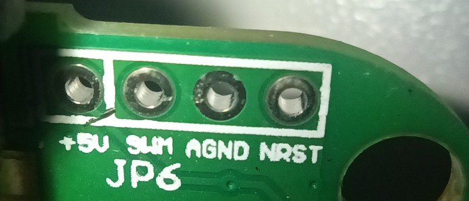

Open-source firmware for SkyRC e430 LiFe/LiPo 4S battery charger.
=================================================================

This project supports only SkyRC e430. Other chargers are not supported.

This firmware will turn your SkyRC e430 into a power supply.

Power on the main charging port is always on (red/black banana plug), no need to plug the battery.
You can select power supply voltage using switches on the front panel:
6 volts: LiPo 1A, LED 1S will activate.
9 volts: LiFe 1A, LED 2S will activate.
15 volts: LiPo 2A, LED 3S will activate.
18 volts: LiFe 2A, LED 4S will activate.

Ports 2S/3S/4S have no power, they are only used to discharge individual cells to balance them.



Hardware required: PZ1 screwdriver and ST-LINK/V2 programmer. It can program both STM32 and STM8 chips, I bet you did not know!
STM32 uses pins SWCLK and SWDIO, while STM8 uses pins SWIM and NRST.

Software required: SDCC compiler, optionally STM8CubeMX for editing .ioc8 project file, standard utilities like make and gcc.

Build instructions for Debian:
```
sudo apt install sdcc
make
```

Build instructions for MacOs and other Linux distributions:
```
Install SDCC using your favorite package manager.
Follow build instructions for Debian.
```

Build instructions for Windows:
```
₊˚ ✧ ‿︵‿୨ 𝔾 𝕆 𝕆 𝔻  𝕃 𝕌 ℂ 𝕂 ୧‿︵‿ ✧ ₊˚
```

Unlock STM8 flash before wirting firmware:
```
stm8flash/stm8flash -c stlinkv2 -p 'stm8s903?3' -u
```

Write firmware:
```
stm8flash/stm8flash -c stlinkv2 -p 'stm8s903?3' -w out/main.ihx

```

SkyRC e430 uses STM8S903K3 8-bit CPU, and no other digital components.

Pin numbers and functions are described in [gpio-test.txt](gpio-test.txt).
