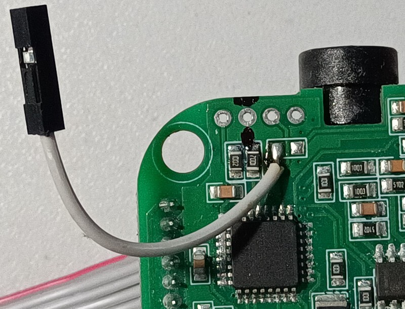

Open-source firmware for SkyRC e430 LiFe/LiPo 4S battery charger.
=================================================================

This project supports only SkyRC e430. Other chargers are not supported.

The problem: SkyRC e430 ruins batteries, because it discharges cell #3 in 4S battery pack until it's unusable.

The solution: Write your own firmware. Easy!

Only 4S battery configuration is supported. Do not plug 2S/3S battery packs, or they will burn!

If you wish to convert your SkyRC e430 into a simple 18 volts power supply unit, use branch
[power-supply](https://github.com/pelya/SkyRC-e430-charger/tree/power-supply).

The circuit board already has contacts for flashing firmware, so you only need to unscrew 4 screws
to open the casing, and connect 4 wires 5.0V, SWIM, GND, and RST from your ST-LINK/V2 programmer
to the 4 pinholes on the circuit board 5V, SWM, AGND, and NRST, and hold them with your finger
while the firmware is flashing - no need to solder them.


Hardware required: PZ1 or PH1 screwdriver and ST-LINK/V2 programmer.

ST-LINK/V2 programmer can program both STM32 and STM8 chips,
I bet you did not know this! STM32 uses pins SWCLK and SWDIO, while STM8 uses pins SWIM and NRST.

Software required: SDCC compiler, optionally STM8CubeMX for editing .ioc8 project file,
and standard utilities like make, git, and gcc.

Build instructions for Debian:
```
sudo apt install sdcc
make
```

Build instructions for MacOs and other Linux distributions:
```
Install SDCC using your favorite package manager.
Follow build instructions for Debian.
```

Build instructions for Windows:
```
₊˚ ✧ ‿︵‿୨ 𝔾 𝕆 𝕆 𝔻  𝕃 𝕌 ℂ 𝕂 ୧‿︵‿ ✧ ₊˚
```

Unlock STM8 flash before writing firmware:
```
stm8flash/stm8flash -c stlinkv2 -p 'stm8s903?3' -u
```

Write firmware:
```
stm8flash/stm8flash -c stlinkv2 -p 'stm8s903?3' -w out/main.ihx

```

SkyRC e430 has only one charging port - the red/black banana socket.
Ports 2S/3S/4S have no power, they are only used to discharge individual cells to balance them.

The charging and balancing/discharging individual cells occurs at the same time.

The charger will balance the battery by discharging high-voltage cells until all cells are
within 0.15 volts between each other.

If any cell reaches 3.45 volts LiFe / 4.00 volts LiPo, the cells are balanced to be
within 0.08 volts between each other.

Only cells that are charged to above 2.5 volts LiFe / 3.0 volts LiPo are discharged/balanced.

If any cell reaches 3.65 volts LiFe / 4.2 volts LiPo, the charger will stop charging
and will only discharge these cells to balance them.

There are no error modes - the charger will try to recover batteries discharged to zero volts,
by always outputting 6 volts to the charging port (the minimum voltage supported by hardware).

When the charging is active, the Status LED is lit red, and Cells Equalizer LEDs are lit
continuously for charging cells, and blinking for discharging cells.

When the charging is inactive, but the cells are balanced, the Status LED is turned off,
and Cells Equalizer LEDs are blinking for discharging cells.

The charging is finished when all cells are between 3.50 - 3.65 volts LiFe / 4.05 - 4.20 volts LiPo.
When the charging is finished, the Status LED is lit green, Cells Equalizer LEDs are turned off,
and the charger will sleep for 24 hours, or until the battery is disconnected.

There is no Constant Voltage (CV) charging, because the charger cannot output precise voltage.

When the battery is absent, the Status LED is slowly blinking red, but the charging port is
always powered to 6 volts. Cells Equalizer LEDs are turned off for cells below 0.5 volts.

The output current switch (1A/2A/3A) will control how often the charger will
shut down power and check the voltage of individual cells,
in addition to increasing charging voltage:

1A: 5 second charge, 1 second sleep + 1 second sleep for each discharging cell.

2A: 7 seconds charge, 1 second sleep + 1 second sleep for each discharging cell.

3A: 10 seconds charge, 1 second sleep + 1 second sleep for each discharging cell.

If any cell reaches 3.45 volts LiFe / 4.00 volts LiPo, the charger will switch
to the 0.4 ampere charging mode with 5 second charge, 1 second sleep + 1 second sleep for each discharging cell.

Discharging resistors are 12 Ohms each, so at 3.60 volts per cell they are discharging
with the current of 0.3 amperes per cell, which means that cells charged to 100%
will stay at roughly the same charge and will not overcharge.

The voltage of the battery is shown using four Cells Equalizer LEDs.
Each decimal digit of the voltage is shown using the sum of 4 LED labels
1S / 2S / 3S / 4S, with zero = all 4 LEDs off.
All 4 LEDs are briefly on when the next digit is shown.

For example the battery is charged to 13.96 volts, the LEDs will light up in this sequence:

|  1S |  2S |  3S |  4S |   Meaning  |
|-----|-----|-----|-----|------------|
|  +  |  +  |  +  |  +  | Next digit |
|  +  |  -  |  -  |  -  |      1     |
|  +  |  +  |  +  |  +  | Next digit |
|  -  |  -  |  +  |  -  |      3     |
|  +  |  +  |  +  |  +  | Next digit |
|  -  |  +  |  +  |  +  |   9=2+3+4  |
|  +  |  +  |  +  |  +  | Next digit |
|  -  |  +  |  -  |  +  |    6=2+4   |


Notes to developers
===================

SkyRC e430 uses STM8S903K3 8-bit CPU, and no other digital components.

Pin numbers and functions are described in [gpio-test.txt](gpio-test.txt).

To view debug logs, you will need an UART adapter.
Solder the connector wire to the contact point closest to the SWM pinhole:



Connect UART adapter RX pin to the debug wire, and GND pin to the AGND pinhole,
then set your UART adapter baudrate to 2400 baud and encoding to 8N1.

Enable `DEBUG_LOGS` option inside [main.h](main.h), then rebuild and flash the debug firmware.

UART logs are written using bit-banging GPIO PD4, so if logs are garbled,
change delay time inside function `DelayBitTime` in [debug.c](debug.c).

